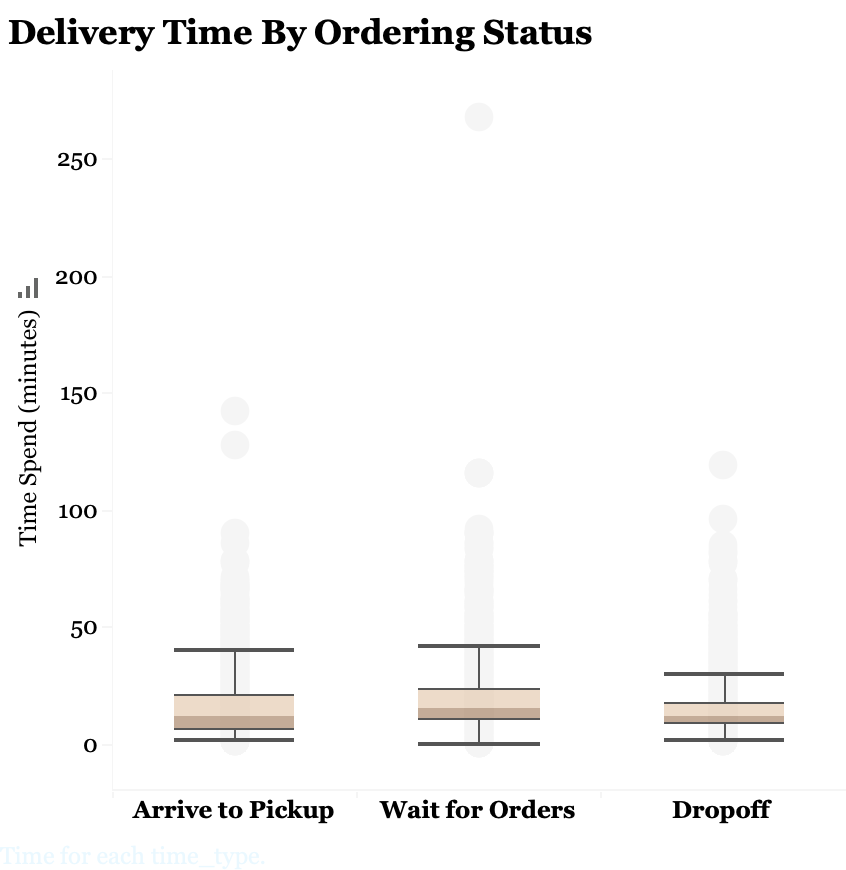
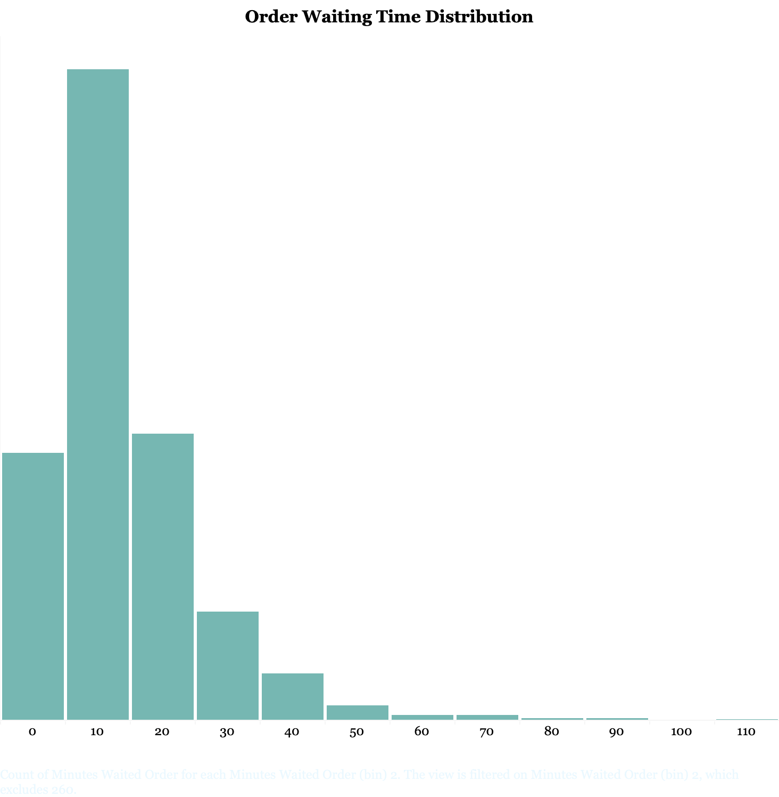
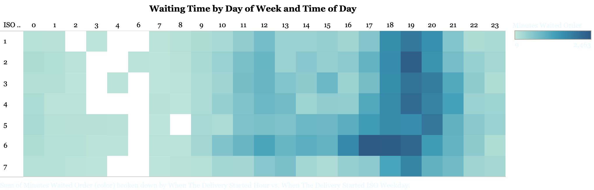

In order to figure out the root cause of order delayed in Postmates, I did analyze the order delivery times by delivery vehicle types, number of items and the time intervals between each ordering stages(submit - pickup - dropoff). And I found the delays were more likely to be caused by the delays in food preparations.

It seems that couriers spend more time waiting in the stores for orders to be ready than the time they spend on transitioning.

Majority of the orders take about 10 minutes additional preparation time when couriers arrive the merchants. And some orders even take more than half-hour waiting time.

The two plots above show the peak hours are round 12pm and 17pm. That's when the order preparation takes longer time.

Given this finding, I would recommend Postmates to create a recommendation engine on the app, which will enable them to disperse order volumes to other similar restaurants especially during peak hours. And test the performance of this new feature by leveraging A/B test.

By adding this feature, Postmates could potentially reduce the number of delayed orders.
