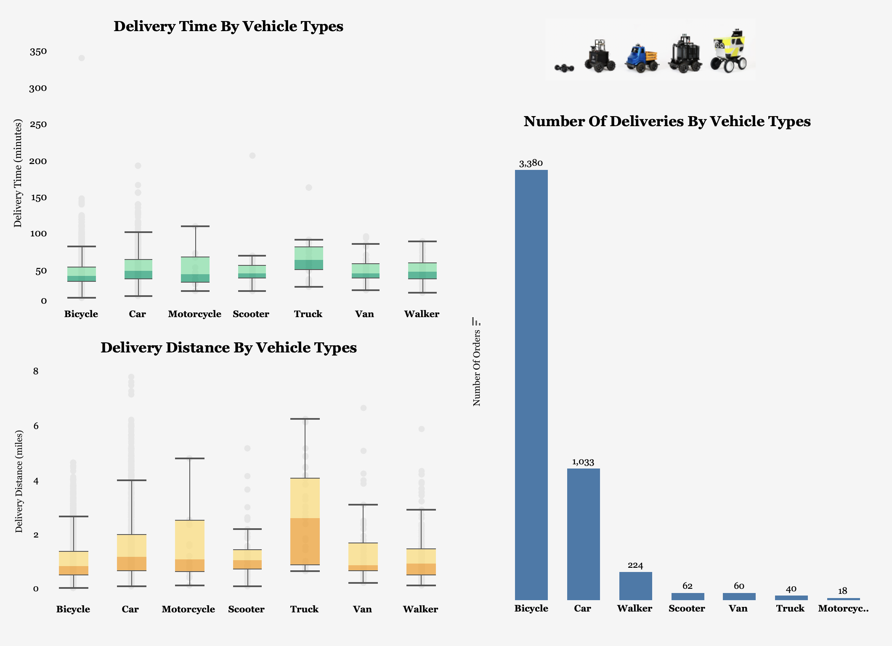
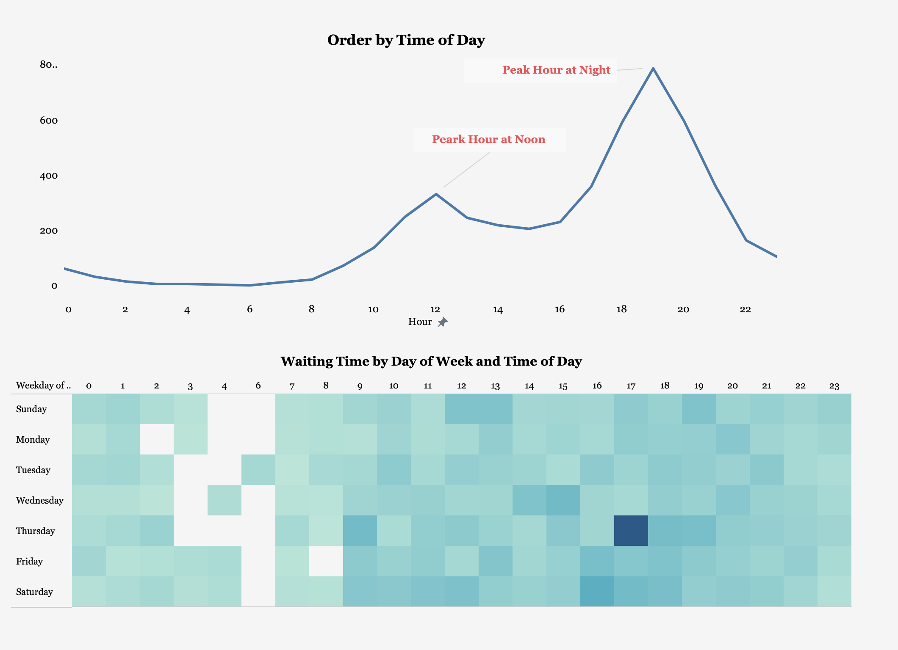

# Postmates: No More Delays
Wenting Deng

## Abstract
The goal of this project was to analyze the root causes of late delivery in Postmates, and how it impacts the business, in order to propose data science solutions to improve delivery efficiencies, and also help Postmates understand how those DS solutions would help their business. The data I worked with were [Postmates transaction data in New York](https://postmates.com/developer), and leveraged [New York zip data](https://public.opendatasoft.com/explore/dataset/us-zip-code-latitude-and-longitude/table/?q=new+york) and [New York neighborhood data](https://www.unitedstateszipcodes.org/) for location mappings. The Postmates dataset contains Oct 2019 transaction information, and the delivery information which includes the couriers' transitioning time and order preparation time, and also the pick up and drop off locations information. After the data exploratory analysis, I was able to find the delayed orders were mainly due to the long order preparation time in some merchants.

## Design
Postmates is a quick-commerce and food delivery service company based in San Francisco. The company offers local delivery of food and other online purchased goods. The company's reviews are very low with only one star on different customer reviews websites, such as Yelp, Site Jabber and Trust Pilot. And the 3 main things customers complain most are Customer Service, Delivery Fee and Late Delivery. By figuring out the causes of late delivery, we could build analytic solutions to help improve delivery efficiencies and thus to improve customer retentions and sales from long term perspective.

* Impact Hypothesis:
  By reducing the number of delayed orders would be helpful in customer experience

* Hypothesis:
  Reducing delayed orders could help Postmates:
    * 1) improve customer retention rate
    * 2) increase sales for long term

* Solution Path
    * Non-DS Solution: add a button for restaurants and let them decide whether take the orders
    * DS Solution: use the clustering model to create a recommendation engine for customers, if the restaurant doesn't take their orders, it will trigger the recommendation engine to show other options

* Measure of Success
    * Technical measure: how accuracy can my clustering model to classify restaurants
    * Non-Technical measure: reduce number of delayed orders

* Risk:
    * Inaccurate in restaurants segmentations
    * Cannibalization: by directing customers to other vendors could increase the competitions between vendors

## Data
The original [Postmates transaction data](https://postmates.com/developer) contains October transactions in New York. The data also includes different time spans throughout the ordering process, the couriers vehicle types, the stores' information and locations and the drop-off places' locations.
I also leveraged two additional geographic datasets, the New York zip data](https://public.opendatasoft.com/explore/dataset/us-zip-code-latitude-and-longitude/table/?q=new+york) and [New York neighborhood data](https://www.unitedstateszipcodes.org/) to enable me to map the location latitudes and longitudes into zip codes and neighborhoods.

All data are saved in [Google Sheet](https://docs.google.com/spreadsheets/d/1VyWN_5H-YmwAPNNFMHLxe733YQuLW-zQKwMWBWJcuoY/edit?usp=sharing)

## Algorithms
**Features Engineering**
1. Removed rows with missing values in the 4 timestamp fields: "when_the_delivery_started", "when_the_Courier_arrived_at_pickup", "when_the_Courier_left_pickup" and "when_the_Courier_arrived_at_dropoff".
2. Calculated durations(minutes) between the 4 timing fields: the durations between order starts and courier arrives at pickup location, the durations between courier arrives and leaves the pickup location, and the durations between courier leaves pickup location and arrives at drop-off location.
3. Mapped pickup and drop-off latitudes/longitude into zips and neighborhoods for map visualization.

**Data Visualization**
Created a Tableau dashboard

**Tools**
* Google Sheet
* Tableau

## Communication
In addition to the slides and visuals presented, it will be embedded on my analytic blog.
